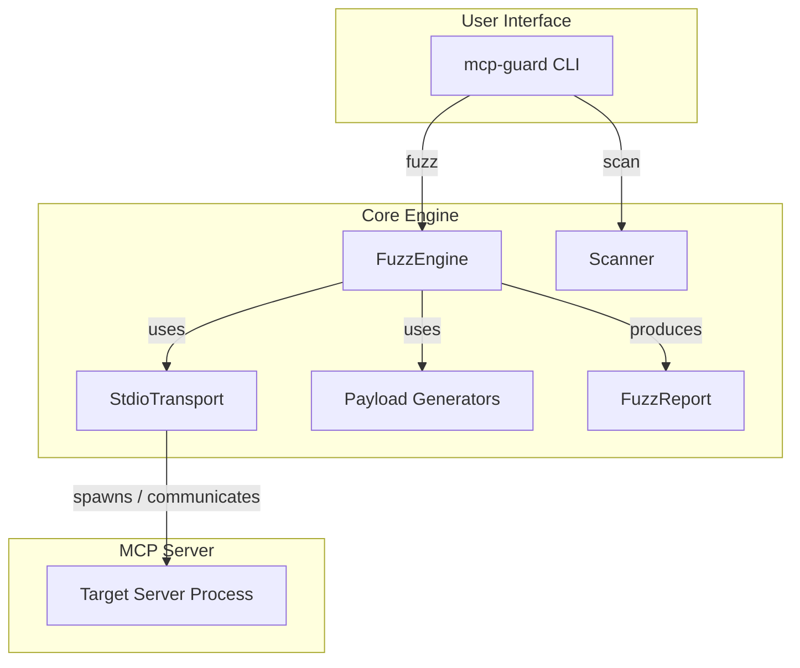
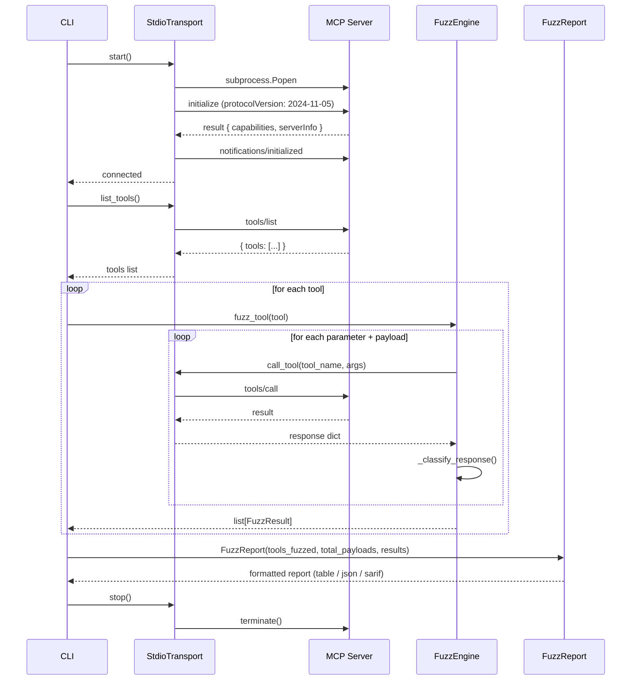

# Architecture

## Overview

mcp-guard is a zero-dependency Python library and CLI tool for adversarial fuzzing of MCP (Model Context Protocol) servers. It operates in two modes: **dynamic fuzzing** (spawning a server and sending real payloads) and **static scanning** (analyzing schemas without execution).



---

## Transport Layer

The transport layer handles all communication with the target MCP server. It is responsible for process lifecycle, JSON-RPC framing, and handshake negotiation.

### StdioTransport

`StdioTransport` spawns the target MCP server as a subprocess and communicates via stdin/stdout using newline-delimited JSON-RPC 2.0 messages.

**Key responsibilities:**

1. **Process Spawn**: Launches the server command with `subprocess.Popen`, piping stdin/stdout/stderr.
2. **Handshake**: Sends an `initialize` request with protocol version `2024-11-05` and client info (`mcp-guard`, `0.2.0`), then sends `notifications/initialized`.
3. **Request/Response**: Implements request-response correlation via incrementing `jsonrpc` `id` fields. Filters out server notifications (messages with `method` but no `id`).
4. **Error Handling**: Raises `ConnectionError` when the server process exits or closes its stdout. Raises `RuntimeError` on MCP-level errors.
5. **Resource Management**: Supports context-manager protocol (`with` statement) for clean startup/shutdown. Terminates the process gracefully on exit, with a fallback to `kill()` if termination times out.

**Interface:**

```python
class StdioTransport:
    def start(self) -> None: ...
    def stop(self) -> None: ...
    def __enter__(self) -> StdioTransport: ...
    def __exit__(self, *args) -> None: ...
    @property
    def is_alive(self) -> bool: ...
    def list_tools(self) -> list[dict]: ...
    def list_resources(self) -> list[dict]: ...
    def list_prompts(self) -> list[dict]: ...
    def call_tool(self, tool_name: str, arguments: dict) -> dict: ...
```

### Sequence Diagram: Dynamic Fuzzing Flow



---

## Fuzzing Engine

`FuzzEngine` is the core dynamic testing component. It receives a transport and a tool schema, generates targeted payloads, fires them, and classifies responses.

### Payload Generation

Payload generation is **schema-aware**. The engine inspects each parameter's `type` and `format` fields, plus parameter names, to select the appropriate payload suite.

```mermaid
flowchart TD
    A[fuzz_tool(tool)] --> B{has inputSchema?}
    B -->|No| C[_fuzz_no_schema]
    B -->|Yes| D{for each param}
    D --> E{is URI param?}
    E -->|Yes| F[generate_ssrf]
    D --> G{param type?}
    G -->|string| H[shell + prompt + overflow3 + type_confusion_string]
    G -->|integer/number| I[type_confusion_integer + overflow_maxint]
    H --> J[fire payload]
    I --> J
    F --> J
    C --> J
    J --> K[_classify_response]
    K --> L[SAFE / FINDING / CRASH / ERROR]
```

**Payload counts per input type:**

| Input Type | Payloads |
|------------|----------|
| String parameter | 25 |
| URI-typed string parameter | 33 |
| Integer / number parameter | 9 |
| No input schema | 24 |

### Response Classification

The `_classify_response` method implements a 4-tier classification:

1. **SAFE**: `isError: true` — the server explicitly rejected the payload.
2. **FINDING** (info leak): `isError: false` but response text contains keywords like `traceback`, `exception`, `stack trace`, `password`, `secret`, `token`.
3. **FINDING** (accepted): `isError: false` and no leakage — payload was silently accepted.
4. **CRASH**: `ConnectionError` raised during `call_tool`.
5. **ERROR**: Any other exception during delivery.

---

## Scanner Pipeline

`Scanner` performs static analysis of MCP tool schemas without spawning a server. It uses keyword matching and schema inspection to flag high-risk patterns.

### Rules

| Rule ID | Severity | Condition |
|---------|----------|-----------|
| `shell-injection` | CRITICAL | Tool name or description contains shell-related keywords (`bash`, `shell`, `command`, `exec`, `powershell`, etc.) OR a parameter description matches those keywords |
| `ssrf-risk` | CRITICAL / WARNING | Parameter has `format: uri` or name/description matches URL keywords. Downgraded to WARNING if the parameter has an `enum` constraint |
| `missing-schema` | WARNING | Tool has no `inputSchema` or no `properties` defined |

### Flow

```mermaid
flowchart LR
    A[scan_tool(tool)] --> B[_check_shell_injection]
    A --> C[_check_ssrf]
    A --> D[_check_missing_schema]
    B --> E[ScanResult?]
    C --> E
    D --> E
    E -->|yes| F[return findings]
    E -->|no| G[PASS]
```

---

## Report Generation

`FuzzReport` aggregates all `FuzzResult` objects and formats them into three output formats.

### Output Formats

| Format | Use Case | Consumer |
|--------|----------|----------|
| **Table** | Human-readable CLI output | Security engineers running locally |
| **JSON** | Structured data for pipelines | CI/CD systems, custom tooling |
| **SARIF** | Static Analysis Results Interchange Format | GitHub Security tab, CodeQL, other SARIF consumers |

### Table Output

Displays a summary header (tools fuzzed, payloads sent, crashes, findings, safe) followed by detailed CRASHES and FINDINGS sections. Findings are truncated to the first 20 entries with a "… and N more" message.

### JSON Output

Includes a `summary` block and a `results` array. SAFE results are excluded from the JSON output to reduce noise.

### SARIF Output

Maps each non-SAFE result to a SARIF `result` object with `ruleId`, `level` (`error` for crashes, `warning` for findings), `message`, and `physicalLocation` (`mcp://{tool_name}`).

---

## CLI Interface

The CLI is built on `argparse` with two subcommands: `fuzz` and `scan`.

### Subcommands

| Subcommand | Description | Options |
|------------|-------------|---------|
| `fuzz` | Dynamic fuzzing of a running MCP server | `--format` (table/json/sarif), `--delay-ms`, `--timeout` |
| `scan` | Static schema scan (no server spawn) | `--format` (table/json) |

### Exit Codes

| Code | Meaning |
|------|---------|
| `0` | All payloads handled safely |
| `1` | Error (connection failure, bad arguments) |
| `2` | Crashes detected |

### Argument Parsing

Both subcommands accept the server command after `--`. The `fuzz` subcommand strips `--` tokens from the command list before passing to `StdioTransport`.

---

## Data Model

### FuzzResult

```python
@dataclass
class FuzzResult:
    tool_name: str
    probe_name: str
    payload_value: object
    category: ResultCategory    # SAFE | FINDING | CRASH | ERROR
    rule_id: str
    severity: str               # critical | high | medium | low | info
    detail: str
    response_preview: str
```

### ScanResult

```python
@dataclass
class ScanResult:
    rule_id: str
    severity: Severity          # CRITICAL | WARNING | INFO
    message: str
    tool_name: str
    remediation: str
```

### Payload

```python
@dataclass(frozen=True)
class Payload:
    value: object
    rule_id: str
    severity: Severity          # CRITICAL | HIGH | MEDIUM | LOW | INFO
    description: str
```

---

## Dependencies

mcp-guard has **zero runtime dependencies**. It uses only Python 3.11+ stdlib modules:

- `json` — JSON-RPC message encoding/decoding
- `subprocess` — server process spawn and lifecycle
- `dataclasses` — result and payload data structures
- `enum` — severity and category enums
- `argparse` — CLI argument parsing
- `typing` — type hints and Protocol definitions

Dev dependencies (`pytest`, `ruff`, `mypy`) are optional and only needed for development.
