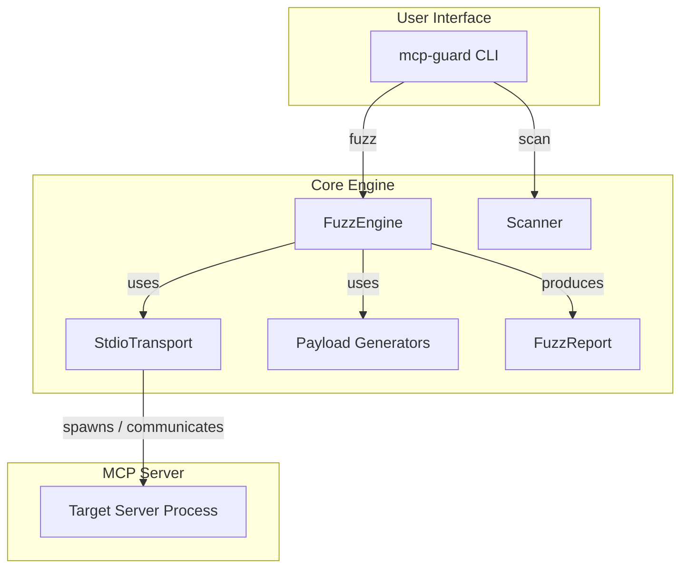
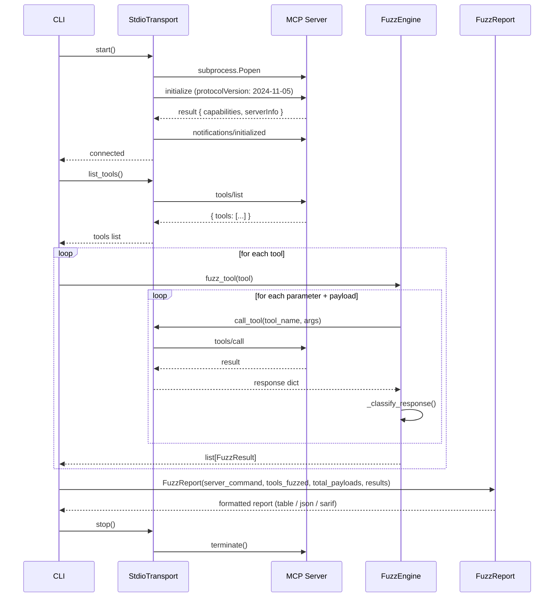
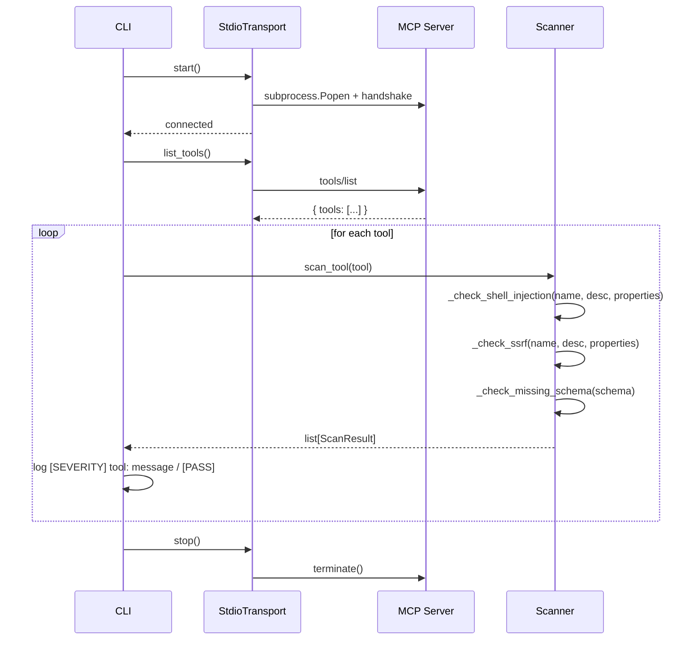

# Architecture

## Overview

mcp-guard is a zero-dependency Python library and CLI tool for adversarial fuzzing of MCP (Model Context Protocol) servers. It operates in two modes: **dynamic fuzzing** (spawning a server and sending real payloads) and **static scanning** (analyzing tool schemas — the server is spawned to enumerate itself, but no payloads are ever fired).


```mermaid
graph TB
    subgraph "User Interface"
        CLI[mcp-guard CLI]
    end

    subgraph "Core Engine"
        FUZZ[FuzzEngine]
        SCAN[Scanner]
        TRANS[StdioTransport]
        PAY[Payload Generators]
        RPT[FuzzReport]
    end

    subgraph "MCP Server"
        SRV[Target Server Process]
    end

    CLI -->|fuzz| FUZZ
    CLI -->|scan| SCAN
    FUZZ -->|uses| TRANS
    FUZZ -->|uses| PAY
    FUZZ -->|produces| RPT
    TRANS -->|spawns / communicates| SRV
```

---

## Transport Layer

The transport layer handles all communication with the target MCP server. It is responsible for process lifecycle, JSON-RPC framing, and handshake negotiation.

### StdioTransport

`StdioTransport` spawns the target MCP server as a subprocess and communicates via stdin/stdout using newline-delimited JSON-RPC 2.0 messages.

**Key responsibilities:**

1. **Process Spawn**: Launches the server command with `subprocess.Popen`, piping stdin/stdout/stderr.
2. **Handshake**: Sends an `initialize` request with protocol version `2024-11-05` and client info (`mcp-guard`, `0.2.1`), then sends `notifications/initialized`.
3. **Request/Response**: Implements request-response correlation via incrementing `id` fields on JSON-RPC 2.0 request envelopes. Notification-shaped messages (`method` present, no `id`) are rejected as invalid responses.
4. **Error Handling**: Raises `ConnectionError` when the server process exits, closes its stdout, or returns a notification-shaped message. Raises `RuntimeError` on MCP-level errors. Raises `TimeoutError` when no response arrives within the configured timeout.
5. **Resource Management**: Supports context-manager protocol (`with` statement) for clean startup/shutdown. Terminates the process gracefully on exit, with a fallback to `kill()` if termination times out.
6. **Concurrency**: Strictly serial. `_read_response` spawns one reader thread per request (threading + queue) so a hung server cannot block the timeout; there is no request pipelining, and a timeout kills the server process outright.

**Interface:**

```python
class StdioTransport:
    def __init__(self, command: list[str], timeout: float = 10.0) -> None: ...
    def start(self) -> None: ...
    def stop(self) -> None: ...
    def __enter__(self) -> StdioTransport: ...
    def __exit__(self, *args) -> None: ...
    @property
    def is_alive(self) -> bool: ...
    def list_tools(self) -> list[dict]: ...
    def list_resources(self) -> list[dict]: ...
    def list_prompts(self) -> list[dict]: ...
    def call_tool(self, tool_name: str, arguments: dict) -> dict: ...
```

### Sequence Diagram: Dynamic Fuzzing Flow


```mermaid
sequenceDiagram
    participant C as CLI
    participant T as StdioTransport
    participant S as MCP Server
    participant E as FuzzEngine
    participant R as FuzzReport

    C->>T: start()
    T->>S: subprocess.Popen
    T->>S: initialize (protocolVersion: 2024-11-05)
    S-->>T: result { capabilities, serverInfo }
    T->>S: notifications/initialized
    T-->>C: connected

    C->>T: list_tools()
    T->>S: tools/list
    S-->>T: { tools: [...] }
    T-->>C: tools list

    loop for each tool
        C->>E: fuzz_tool(tool)
        loop for each parameter + payload
            E->>T: call_tool(tool_name, args)
            T->>S: tools/call
            S-->>T: result
            T-->>E: response dict
            E->>E: _classify_response()
        end
        E-->>C: list[FuzzResult]
    end

    C->>R: FuzzReport(server_command, tools_fuzzed, total_payloads, results)
    R-->>C: formatted report (table / json / sarif)

    C->>T: stop()
    T->>S: terminate()
```

---

## Fuzzing Engine

`FuzzEngine` is the core dynamic testing component. It receives a transport and a tool schema, generates targeted payloads, fires them, and classifies responses.

### Payload Generation

Payload generation is **schema-aware**. The engine inspects each parameter's `type` and `format` fields, plus parameter names, to select the appropriate payload suite.

```mermaid
flowchart TD
    A[fuzz_tool(tool)] --> B{has inputSchema?}
    B -->|No| C[_fuzz_no_schema]
    B -->|Yes| D{for each param}
    D --> E{is URI param?}
    E -->|Yes| F[generate_ssrf]
    D --> G{param type?}
    G -->|string| H[shell + prompt + indirect + overflow3 + type_confusion_string]
    G -->|integer/number| I[type_confusion_integer + overflow_maxint]
    H --> J[fire payload]
    I --> J
    F --> J
    C --> J
    J --> K[_classify_response]
    K --> L[SAFE / FINDING / CRASH / ERROR]
```

**Payload counts per input type:**

| Input Type | Payloads |
|------------|----------|
| String parameter | 29 |
| URI-typed string parameter | 37 |
| Integer / number parameter | 9 |
| No input schema | 24 |

Tools with no input schema are fuzzed with the shell + SSRF + first-two-overflow + prompt-injection suites; each payload is fired with its `rule_id` (e.g. `"shell-injection"`) as the argument name, since there is no schema parameter to bind to.

**Post-crash behavior:** the engine does not stop when the server dies. Every remaining payload then raises `ConnectionError("Server not running")` in `_send` and is recorded as a CRASH — one real crash can therefore manufacture phantom CRASH findings for all unfired payloads, inflating the crash count and forcing exit code 2.

### Response Classification

`_classify_response` maps a tool call's outcome to a category plus an evidence-graded severity. The deliberate default is **FINDING, never SAFE**: for a pre-deployment security fuzzer, a silently-executed payload is observationally identical to a neutralized one, and resolving that ambiguity as SAFE would let a CLEAN verdict assert safety it cannot verify. The operational cost is honest: a full fuzz run reports an info-level FINDING for every payload that produced no observable effect, so triage at scale means filtering by severity and rule id, not reading every row.

| Outcome | Category | Severity | Rule ID pattern |
|---------|----------|----------|-----------------|
| `isError: true` — server explicitly rejected the payload | SAFE | payload's severity | — |
| Payload was an `indirect-injection` probe and `INDIRECT_CANARY` appears in the tool **output** — attacker-controlled input was reflected onto the data channel a downstream agent reads (OWASP ASI01, EchoLeak/CurXecute pattern) | FINDING | high | `reflection-untrusted-echo` |
| Payload was an `indirect-injection` probe and the tool output contains a markdown image pointing at an external URL — an exfil channel | FINDING | critical | `indirect-injection-exfil-channel` |
| `isError: false` and the response text leaks internal information (keywords: `traceback`, `exception`, `stack trace`, `error:`, `internal`, `password`, `secret`, `token`) | FINDING | high | `{payload.rule_id}-info-leak` |
| Payload bytes (≥6 chars) were reflected in the tool output but nothing executed — reflection is not execution. Execution-class payloads (shell, SSRF, overflow) are capped at medium; only `prompt-injection`/`indirect-injection` keep the payload's severity, because there the reflection itself reaches a downstream agent | FINDING | medium (or payload severity for prompt-injection) | `{payload.rule_id}-unconfirmed-reflection` |
| Payload produced no observable effect — not reflected, no error, no leak. Silent execution cannot be ruled out by black-box probing alone | FINDING | info | `{payload.rule_id}-no-observable-effect` |
| `ConnectionError` raised during `call_tool` — the server process died or closed the connection | CRASH | payload's severity | payload's `rule_id` |
| Any other exception during delivery | ERROR | payload's severity | payload's `rule_id` |

**Check order matters:** the canary check runs before the exfil-channel check. Because the exfil payload itself embeds `INDIRECT_CANARY`, a server that echoes the payload verbatim produces `reflection-untrusted-echo`, not `indirect-injection-exfil-channel` — the latter fires only when the server strips the canary but keeps the markdown-image exfil channel.

---

## Scanner Pipeline

`Scanner` performs static analysis of MCP tool schemas without spawning a server. It uses keyword matching and schema inspection to flag high-risk patterns.

### Rules

| Rule ID | Severity | Condition |
|---------|----------|-----------|
| `shell-injection` | CRITICAL | Tool name or description contains shell-related keywords (`bash`, `shell`, `command`, `exec`, `powershell`, etc.) OR a parameter name or description matches those keywords |
| `ssrf-risk` | CRITICAL / WARNING | Parameter has `format: uri` or name/description matches URL keywords. Downgraded to WARNING if the parameter has an `enum` constraint |
| `missing-schema` | WARNING | Tool has no `inputSchema` or no `properties` defined |

### Flow

```mermaid
flowchart LR
    A[scan_tool(tool)] --> B[_check_shell_injection]
    A --> C[_check_ssrf]
    A --> D[_check_missing_schema]
    B --> E[ScanResult?]
    C --> E
    D --> E
    E -->|yes| F[return findings]
    E -->|no| G[PASS]
```

### Sequence Diagram: Static Scan Flow


```mermaid
sequenceDiagram
    participant C as CLI
    participant T as StdioTransport
    participant S as MCP Server
    participant K as Scanner

    C->>T: start()
    T->>S: subprocess.Popen + handshake
    T-->>C: connected

    C->>T: list_tools()
    T->>S: tools/list
    S-->>T: { tools: [...] }

    loop for each tool
        C->>K: scan_tool(tool)
        K->>K: _check_shell_injection(name, desc, properties)
        K->>K: _check_ssrf(name, desc, properties)
        K->>K: _check_missing_schema(schema)
        K-->>C: list[ScanResult]
        C->>C: log [SEVERITY] tool: message / [PASS]
    end

    C->>T: stop()
    T->>S: terminate()
```

Note the scan path reports through the logging channel (one `[SEVERITY]`/`[PASS]` line per tool); it does not build a `FuzzReport`. No payloads are ever fired — the server is only asked to describe itself.

---

## Report Generation

`FuzzReport` aggregates all `FuzzResult` objects and formats them into three output formats.

### Output Formats

| Format | Use Case | Consumer |
|--------|----------|----------|
| **Table** | Human-readable CLI output | Security engineers running locally |
| **JSON** | Structured data for pipelines | CI/CD systems, custom tooling |
| **SARIF** | Static Analysis Results Interchange Format | GitHub Security tab, CodeQL, other SARIF consumers |

### Table Output

Displays a summary header (tools fuzzed, payloads sent, crashes, findings, safe) followed by detailed CRASHES and FINDINGS sections. Findings are truncated to the first 20 entries with a "… and N more" message.

### JSON Output

Includes a `summary` block and a `results` array. SAFE results are excluded from the JSON output to reduce noise.

### SARIF Output

Maps each non-SAFE result to a SARIF `result` object with `ruleId`, `level` (`error` for crashes, `warning` for every other non-SAFE result), `message`, and a location of `physicalLocation.artifactLocation.uri = mcp://{tool_name}`.

### Provenance and count verification

Every emitted report carries a `_provenance` block (scanner identity, scanner version, run id, UTC timestamp, data source, payload-ruleset version), so a downstream consumer can answer "where did this number come from?" without trusting the channel the report arrived on. Category counts, `total_payloads`, and `tools_fuzzed` are recomputed from the raw results list by `verify_counts()`; the formatters refuse to emit a report whose summary disagrees with its results — they raise an exception (surfacing as exit code 1) instead of printing numbers that cannot be re-derived in code.

---

## CLI Interface

The CLI is built on `argparse` with two subcommands: `fuzz` and `scan`.

### Subcommands

| Subcommand | Description | Options |
|------------|-------------|---------|
| `fuzz` | Dynamic fuzzing of a running MCP server | `--format` (table/json/sarif), `--delay-ms`, `--timeout` |
| `scan` | Static schema scan (no payloads fired) | `--format` (table/json) |

The `scan` subcommand accepts `--format` but currently reports through the logging channel (one `[SEVERITY] tool: message` / `[PASS]` line per tool) rather than formatted output. Both subcommands accept the server command after `--` and strip `--` tokens from the command list before passing it to `StdioTransport`. Global flags: `--verbose`, `--quiet` (logging verbosity).

### Exit Codes

| Code | Meaning |
|------|---------|
| `0` | Clean — no crashes; informational findings are still reported |
| `1` | Error (connection failure, bad arguments) |
| `2` | Crashes detected |

### Argument Parsing

Both subcommands accept the server command after `--`. The `fuzz` subcommand strips `--` tokens from the command list before passing to `StdioTransport` (the `scan` subcommand does the same).

---

## Data Model

### FuzzResult

```python
@dataclass
class FuzzResult:
    tool_name: str
    probe_name: str
    payload_value: object
    category: ResultCategory    # SAFE | FINDING | CRASH | ERROR
    rule_id: str
    severity: str               # critical | high | medium | low | info
    detail: str
    response_preview: str
```

### ScanResult

```python
@dataclass
class ScanResult:
    rule_id: str
    severity: Severity          # CRITICAL | WARNING
    message: str
    tool_name: str
    remediation: str
```

### Payload

```python
@dataclass(frozen=True)
class Payload:
    value: object
    rule_id: str
    severity: Severity          # CRITICAL | HIGH | MEDIUM | LOW | INFO
    description: str
```

---

## Dependencies

mcp-guard has **zero runtime dependencies**. It uses only Python 3.11+ stdlib modules:

- `json` — JSON-RPC message encoding/decoding
- `subprocess` — server process spawn and lifecycle
- `threading`, `queue` — per-request reader threads with timeout in the transport
- `re` — exfil-channel pattern matching in the response classifier
- `dataclasses` — result and payload data structures
- `enum` — severity and category enums
- `argparse` — CLI argument parsing
- `sys` — exit codes
- `uuid`, `datetime` — report run ids and timestamps
- `typing` — type hints and Protocol definitions

Dev dependencies (`pytest`, `pytest-cov`, `ruff`, `mypy`, `pyyaml`) are optional and only needed for development.
